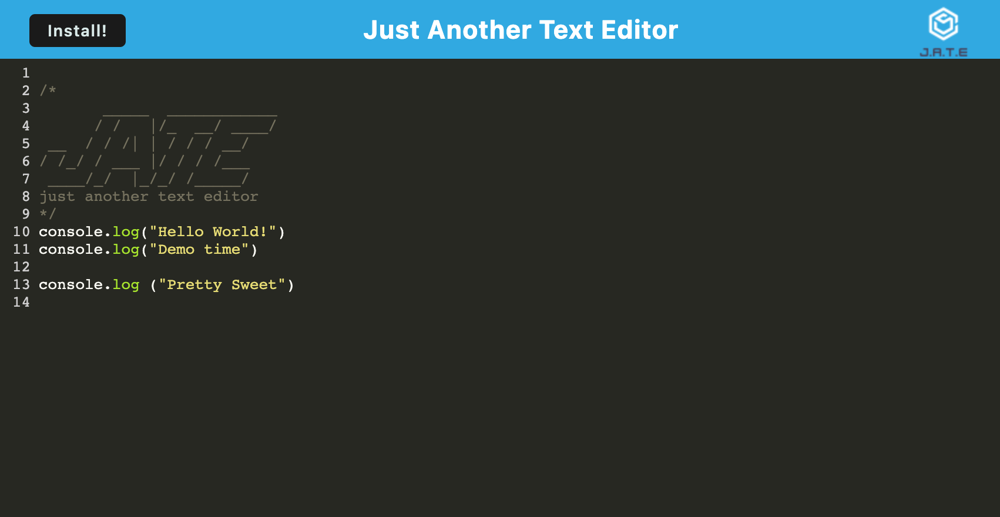

# pwa-text-editor

## Table of Contents

- [Description](#description)
- [Installation](#installation)
- [Usage](#usage)
- [Demo](#demo)
- [Screenshot](#screenshot)
- [Testing](#testing)
- [Lanuages](#languages)
- [License](#license)
- [Contact](#contact)

## Description

A text editor that runs in the browser, featuring a number of data persistence techniques that serve as redundancy in case one of the options is not supported by the browser. The application will also function offline.
The application gets and stores data to an IndexedDB database, using idb, a lightweight wrapper around the IndexedDB API. It features a number of methods that are useful for storing and retrieving data, and is used by companies like Google and Mozilla.

## Installation

Open the app using the heroku demo link below. For offline use, click the install from the app's browser window and save on user's local machine.

## User Story

AS A developer
I WANT to create notes or code snippets with or without an internet connection
SO THAT I can reliably retrieve them for later use

## Demo

[Click](https://nameless-wildwood-89668.herokuapp.com/) for deployed application

## Screenshot

## Testing

## Languages

- [JavaScript](https://www.javascript.com)
- [Heroku](https://www.heroku.com/home)
- [Express](https://expressjs.com)
- [Node.js](https://nodejs.org/en)
- [NPM](https://www.npmjs.com)
- [webpack](https://webpack.js.org)

## License

MIT

## Contact:

ShawnArgent (https://github.com/ShawnArgent)  
 kshawn001@gmail.com
